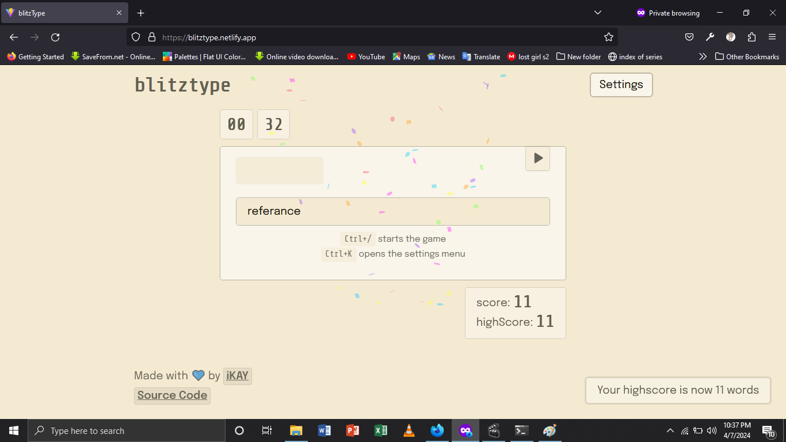

# blitztype

## Introduction
A platform for boosting your typing speed and accuracy. Complete with:

- **Offline Mode** - After first load, the website will be cached, and can be used without internet connection  
- **Wordstorm Mode** - Find out how many words you can type in a certain amount of time
- **Multiple Modes** - Use dark, light, and more modes 

## Usage
Go to [blitztype.netlify.app](https://blitztype.netlify.app/) , and start typing

## License
This project is available under the [MIT](http://opensource.org/licenses/MIT) software licence  
  
